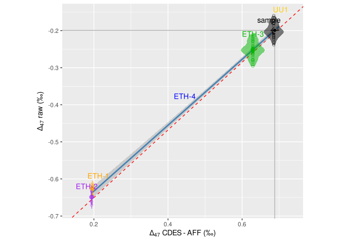

<!-- README.md is generated from README.Rmd. Please edit that file -->

[](https://cran.r-project.org/package=stdsim)

# stdsim

The goal of stdsim is to simulate sample and standard measurements to
allow optimisation of the Empirical Transfer Function, the calibration
from the machine scale of standards to an absolute reference frame.

## Installation

You can install the released version of stdsim from
[GitHub](https://github.com/japhir) with:

``` r
devtools::install_github("japhir/stdsim")
```

## Example

This shows how to run one simulation with some input parameters:

``` r
options(genplot=TRUE, verbose=TRUE)
library(stdsim)
#> now dyn.load("/usr/lib/R/library/grid/libs/grid.so") ...
#> now dyn.load("/usr/lib/R/library/colorspace/libs/colorspace.so") ...
#> now dyn.load("/usr/lib/R/library/glue/libs/glue.so") ...
#> now dyn.load("/usr/lib/R/library/ellipsis/libs/ellipsis.so") ...
#> now dyn.load("/usr/lib/R/library/fansi/libs/fansi.so") ...
#> now dyn.load("/usr/lib/R/library/utf8/libs/utf8.so") ...
#> now dyn.load("/usr/lib/R/library/vctrs/libs/vctrs.so") ...
#> now dyn.load("/usr/lib/R/library/tibble/libs/tibble.so") ...
#> now dyn.load("/usr/lib/R/library/purrr/libs/purrr.so") ...
#> now dyn.load("/usr/lib/R/library/dplyr/libs/dplyr.so") ...
#> now dyn.load("/usr/lib/R/library/lattice/libs/lattice.so") ...
#> now dyn.load("/usr/lib/R/library/nlme/libs/nlme.so") ...
sim_stds(stdfreqs=c(1, 1, 9, 0, 0), stdn=50, smpn=30, stdev=25, smpt=5, out="pl")
#> starting simulation
#> simulating sample measurements
#> simulating standard measurements
#> 2 standard measurements not simulated due to roundoff.
#> calculating empirical transfer function (ETF)
#> applying ETF to sample
#> calculating summary statistics of raw values
#> calculating 95% confidence intervals of regression at computed raw value in raw space
#> calculating 95% confidence intervals of sample in expected space
#> creating plots
#> now dyn.load("/usr/lib/R/library/Rcpp/libs/Rcpp.so") ...
#> now dyn.load("/usr/lib/R/library/ggrepel/libs/ggrepel.so") ...
#> `geom_smooth()` using formula 'y ~ x'
#> now dyn.load("/usr/lib/R/library/splines/libs/splines.so") ...
#> now dyn.load("/usr/lib/R/library/Matrix/libs/Matrix.so") ...
#> now dyn.load("/usr/lib/R/library/mgcv/libs/mgcv.so") ...
#> now dyn.load("/usr/lib/R/library/farver/libs/farver.so") ...
```


    #> `geom_smooth()` using formula 'y ~ x'


